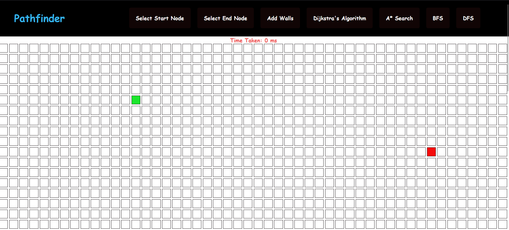
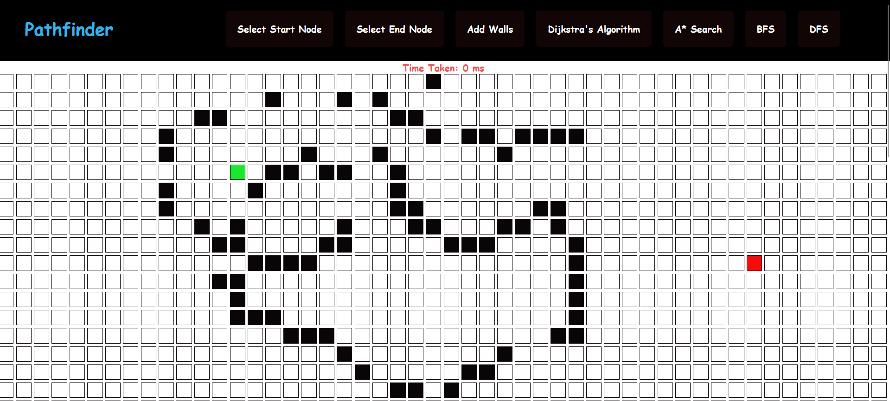
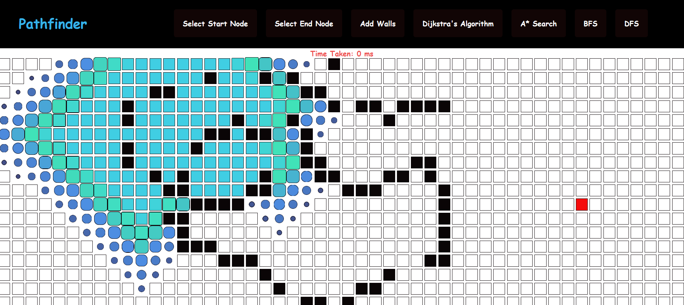
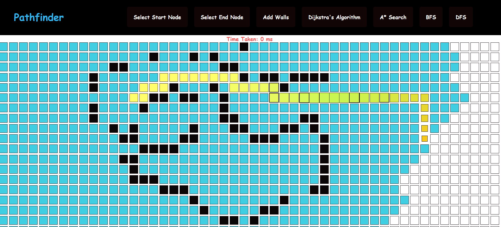

## Pathfinding Visualiser

- Dijkstra's algorithm is a popular algorithm used to find the shortest path between two nodes in a graph. The visualization allows you to see how the algorithm explores the graph and determines the shortest path.

- Along with Dijikstra's Algorithm this visualiser provides you how other Algorithms like A* - Star , DFS and BFS search the entire graph in order to find the shortest path to reach the desired end node .

- You can play around with this website link : https://visualisepath.netlify.app/

## Installation and Setup

1. **Prerequisites:**
   - Node.js and npm installed.

2. **Clone the Repository:**
   ```sh
   git clone https://github.com/deepakkumartripathi119/Path-finding-visualiser.git
   cd Path-finding-visualiser
   ```

4. **Final Setup:**
   
   - Install dependencies:
     ```sh
     npm install
     ```
   - Start the React app:
     ```sh
     npm start
     ```
   - The application should now be running on `http://localhost:3000`.
  

## Features and Interfaces

1. Selection of Start and End Node<br>

<br>

2.Adding Walls<br>
<br>

3. Visual of Algorithm in Function<br>

<br>

4. Shortest Path.<br>
<br></br>

   
